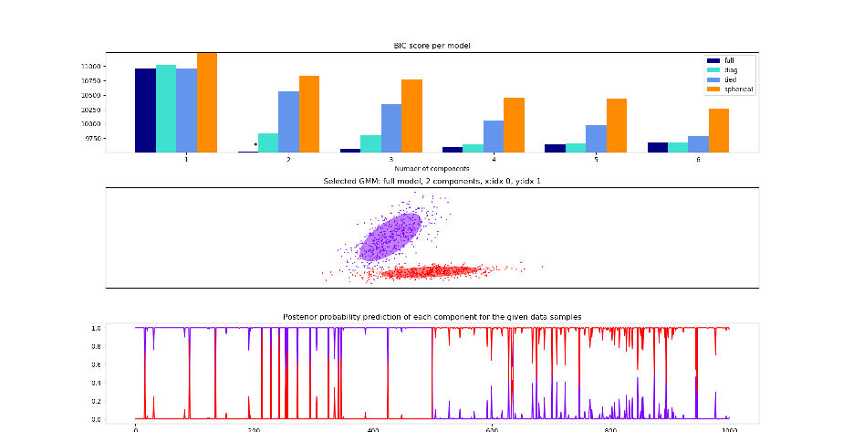

The script is modified from https://scikit-learn.org/stable/auto_examples/mixture/plot_gmm_selection.html. The original script shows the BIC-based Gaussian mixture model selection mechanism using Scikit-learn. In this modification, some conditional statements are added to plot different types of covariance.

